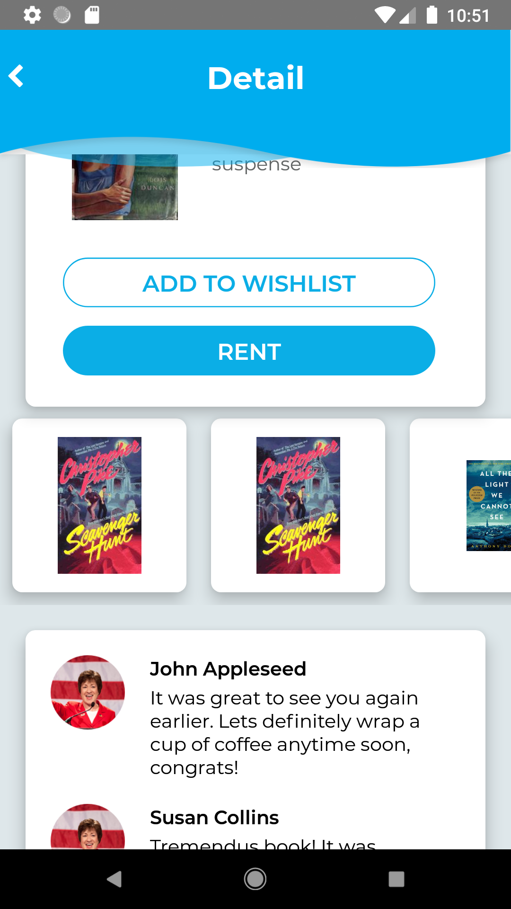

# Books Rental

Books Rental is an app that shows differents books to their users, this MVP allows to login as invite user and explore some books, that are fetched from a fake rest API, using JSON server and mocked data. Besides the app shows the detail of the book and suggest others book options according to the book's genre. 

It was built using React Native, so it's available to use on both Android and iOS. Besides It implements analytics and logs some events on FireBase.

Books Rental app fetches the data from the following [API](https://my-json-server.typicode.com/josecarvajal8/fake-rest/books).

## Preview

### iOS

    
    
    

### Android

    
    
    

## Before you begin
Please make sure you are using the required dev tools to run a React Native project

## Installation
To start checking this project please proceed with the scripts bellow:

    $ git clone https://github.com/josecarvajal8/react-native-books-rental.git
    $ yarn install
----

## Run the app
To start running the app in debug mode first make sure you start the metro bundler by running this script:

    $ yarn start

Then execute the following script:

Android: 

    $ yarn android
    
iOS: 

    $ yarn ios:pod && yarn ios

Thanks
------

**Jose Carvajal**

> GitHub [@josecarvajal08](https://github.com/josecarvajal8)